# NXP Application Code Hub

## Portable Anomaly Detect Demo with FRDM-MCXN947 and FXLS8974CF (ML Vibro Sens Click)

This demo shows the power of in-situ trained Machine Learning running on MCXN947 using 3 axes of vibration data from FXLS8974CF (3-axis accelerometer). This design runs on FRDM-MCXN947 evaluation board, mated to LCD-PAR-S035 (touch / display). 

A generic “machine” (source of live vibration data) is emulated using ML Vibro Sense Click from Mikroe (**Refer to Hardware section below**). This click board plugs into the FRDM-MCXN947 eval board. 

The ML Vibro Sense Click board contains two small electric motors, with NXP’s FXLS8974 3-axis accelerometer mounted between them. Vibration (acceleration) data is continuously streamed from the FXLS8974CF to the MCXN947 MCU across the I2C bus.  

-	The upper motor is intentionally unbalanced. A Pulse Width Modulated (PWM) signal is applied to its power switch circuit via the mikroBUS’s PWM line (marked as “UNB” above). Various PWM waveforms can be sent to emulate atypical vibration signatures. Varying the frequency, the PWM duty cycle and the on/off frequency of this signal gives the user the ability to emulate many interesting vibration stimuli.  
-	The lower motor is balanced. This motor is typically driven fully on, or off, using the CS pin of the mikroBUS (marked as “BAL” above). During training, the Balanced Motor is used to generate a nominal baseline vibration signature – emulating a healthy machine.

The demo uses the LVGL graphics framework and a TFT Display (LCD-PAR-S035) to show the ML analysis. The GUI was designed using GUI Guider (NXP).

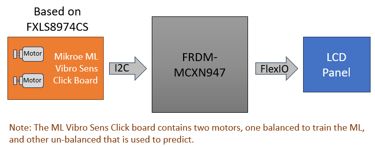

#### Boards: FRDM-MCXN947

#### Accessories: ML Vibro Sens Click

#### Categories: Sensor, AI/ML, Anomaly Detection

#### Peripherals: DISPLAY, I2C

#### Toolchains: MCUXpresso IDE, VS Code

## Table of Contents

1. [Software](#step1)
2. [Hardware](#step2)
3. [Setup](#step3)
4. [Results](#step4)
5. [FAQs](#step5)
6. [Support](#step6)
7. [Release Notes](#step7)

## 1. Software 
- [MCXUpresso SDK 2.14.0 for FRDM-MCXN947](https://mcuxpresso.nxp.com/en/builder?hw=FRDM-MCXN947)
- [MCUXpresso IDE v11.9.0 or later](https://www.nxp.com/design/design-center/software/development-software/mcuxpresso-software-and-tools-/mcuxpresso-integrated-development-environment-ide:MCUXpresso-IDE)

## 2. Hardware 
For this demo you will need the next hardware.
* [FRDM-MCXN947 MCU board](https://www.nxp.com/part/FRDM-MCXN947) 
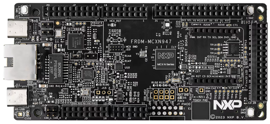 

* [LCD-PAR-S035 TFT Display](https://www.nxp.com/design/design-center/development-boards-and-designs/general-purpose-mcus/3-5-480x320-ips-tft-lcd-module:LCD-PAR-S035)  
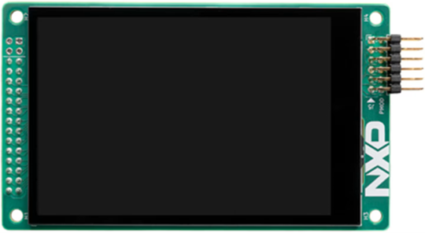 

* [ML Vibro Sens Click](https://www.mikroe.com/ml-vibro-sens-click) 
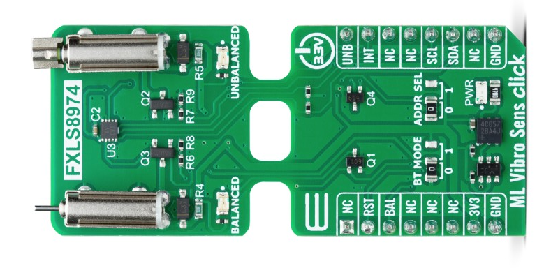 

## 3. Setup 

### 3.1 Step 1: Connect Display to FRDM-MCXN947
- Check that the switch SW1 In the LCD is set to 010 (16bits 8080) and plug-in the LCD in the board (use the next image like reference) you should connect the LCD in the J8 header with two pins free in the top of the header.

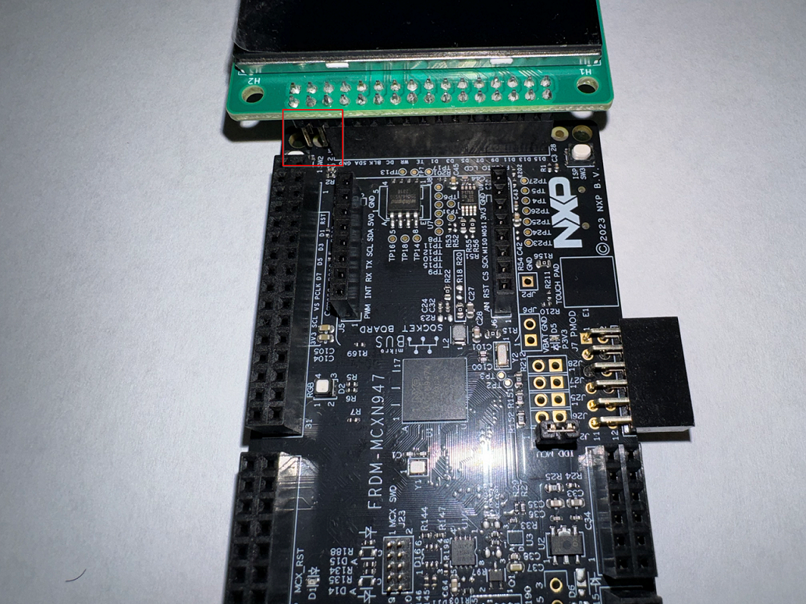

### 3.2 Step 2: Connect ML Vibro Sens Click board atop FRDM-MCXN947
- Plug-in the ML Vibro Sens Click atop the native mikroe slot of the FRDM board. 
- Then plug-in the USB cable between the host PC and the FRDM-MCXN947.  
*See the figure below for reference.*  

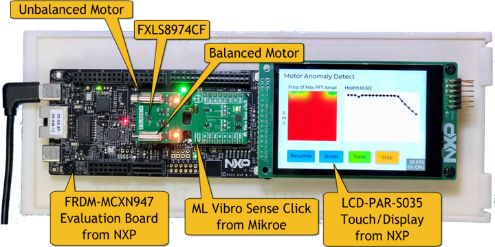

### 3.3 Step 3: Download and Install required Software(s)
- Download [MCUXpresso IDE 11.9.0 or newer](https://www.nxp.com/design/design-center/software/development-software/mcuxpresso-software-and-tools-/mcuxpresso-integrated-development-environment-ide:MCUXpresso-IDE?&tid=vanMCUXPRESSO/IDE) and Install following the installer instructions.
- Download [MCXUpresso SDK 2.14.0 for FRDM-MCXN947](https://mcuxpresso.nxp.com/en/builder?hw=FRDM-MCXN947). Make sure to select ISSDK middleware while building SDK. **Make sure to change version to 2.14.00 and build SDK for MCUXpresso IDE.**
- Install Git v2.39.0 (for cloning and running west commands)

### 3.4 Step 4: Build demo project
- Open MCUXpresso IDE and select a directory to create your workspace.
- Install "MCXUpresso SDK 2.14.0 for FRDM-MCXN947" (drag and drop SDK zip into "Installed SDK" view) into MCUXpresso IDE.
- Go to "Quickstart Panel" and click on "Import from Application Code Hub".  
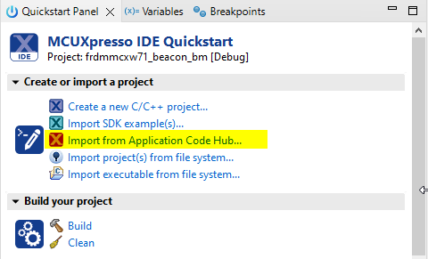  
- Enter "portable-anomaly-detect" in search bar.  Select project card.
- Click "GitHub link" within wizard to copy github information into IDE wizard.  
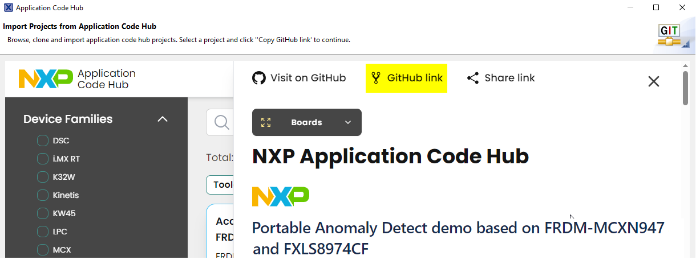  
- Continue to follow the default steps of the Wizard.  Click Next, Click Next for "main" branch.
- Select the desired destination to store the imported project.  Initial branch = main.  Click Next.
- Click next to select the discovered Eclipse projects.
- Click Finish to complete the import into workspace.
  
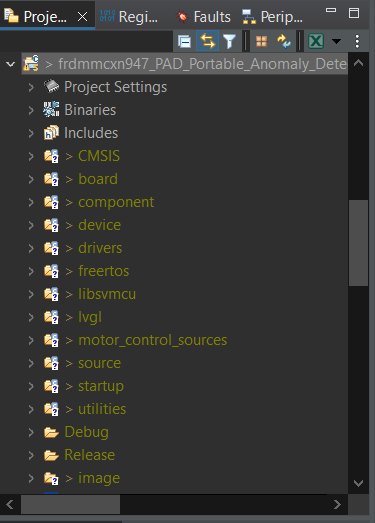  
- Right click on project and select build to start building the project.

### 3.5 Develop in VS code
- Download and install Visual Studio Code v1.95.2 or latest version.

- In VS code, select the 'MCUXpresso For VScode' plugin, and click 'Application Code Hub' in the QUICKSTART PANEL. 

- Search 'portable-anomaly-detect' example, clone to local workspace.

- After a while, the project is shown in the 'Projects'.

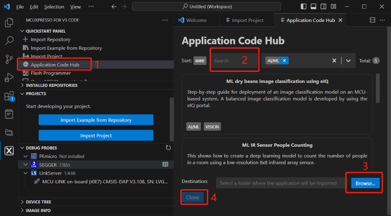

- Build the project, after compile complete flash the board.

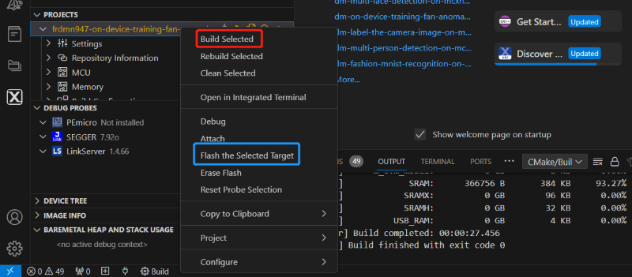

## 4. Results 

- Reset the board, the main window will look like the following figure. Note that this will happen only the first time the demo is run and if the Model (OC-SVM) hasn't been trained. After the Model is trained and stored on the FLASH of the MCXN947 MCU, then the main display will automatically run the model and the Demo Heat Map will update accordingly.

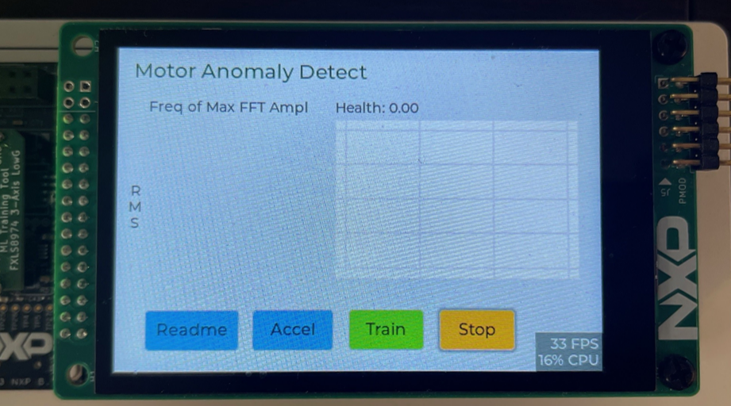

### 4.1 Train OC-SVM on "Normal" vibration pattern
- Click "Train" button on the touch panel GUI, enter OC-SVM training window.
- Click "Start" button and the balanced motor will start running to train the OC-SVM model on the normal vibration pattern.
- The progress bar will show the status of the OC-SVM training, wait for the progress bar to complete. 

During the training, a Red/Green heat map was created. Red is bad; Green is good. A strip chart showing the time history of machine’s health is also painted. When training is concluded, you return to the main demo window and witness this heat map. The demo self-runs from here. A transient white dot appears on the heat map at each health analysis recurrence. The more “in the Green” the series of analyses is, the higher the machine health score (an arbitrary scale of -10 to +10).

As the demo proceeds, the Balanced motor will alternate between On and Off states and the Unbalanced motor will alternate between OFF and Various Speeds – creating differing “anomalous” vibration signatures.

Note: While training the OC-SVM it is highly recommended to avoid surrounding vibrations as that can impact the dataset on which model training is getting done.

### 4.2 Test the trained OC-SVM model to predict
Click "Return" button, the demo unit will run following sequence to test the trained OC-SVM model.
- Both of the tiny motors will stop running and OC-SVM trained model will detect "Anomaly" status.
- After few seconds, the balanced motor will start running and OC-SVM trained model will detect "Normal" status.
- After few seconds, the unbalanced motor will start running to introduce higher vibrations and OC-SVM trained model will detect "Anomaly" status.

### 4.3 The demo runs with updated models.
The demo runs forever, continuously assessing and conveying machine health while full-off, nominal, and atypical vibration signatures are continuously varied by the Balanced and Unbalanced motors.

In an industrial setting, there are typically 100’s to 1000’s of valuable deployment points for this application. Any moving machinery or mechanism can be monitored with an SVM based vibration health monitor. Any anomalous condition can be automatically flagged and remedy immediately dispatched to prevent a catastrophic failure and costly down time. Such conditions may include: failing bearings/bushings, stall conditions, pump cavitation, broken impeller pump, unbalanced machine conditions, transient impacts, surge conditions, etc. 

These conditions may occur in deeply embedded equipment or on equipment that is sited remotely, away from expert human technicians. There is great value in being able to identify faltering equipment early, especially machinery sited on roof-tops, deep within large assemblies, or in underground vaults. Early detection and remedy can prevent catastrophic events.

## 5. FAQs 

The 'Param' setting in training windows.

The Gam is “Gamma (γ)”, Nu is “Nu (ν)”, they are two parameters to tune the trade-off between sensitivity and tolerance of the trained model.

For most demo settings, the default values (Gam: 0050, Nu: 0.1) often lead to a reasonable tradeoff between sensitivity and tolerance. 

* With larger Nu, the model is more sensitive to data change, but very large Nu (such as >=0.4) can make the model treating some training samples that are far from average as abnormal! So if you want a high sensitivity and quick-response demo, you should use larger Nu (such as 0.1 to 0.4); but if you want the demo more tolerant to random or accidental disturb, you should use smaller Nu (such as 0.03 to 0.1)
  
* With larger Gamma, the model tends to treat the training data to multiple clusters (each training sample’s effective range gets smaller), So if your normal state contains multiple sub-states (such as both fan-off and fan-on are normal), then you should use larger Gamma (such as 20 to 200); but larger Gamma also makes the model less robust to the randomness in training data, so if your demo environment is heavily disturbed (such as by the vibration of a working computer, the air vibration by nearby fans, walking persons nearby), you should use smaller gamma (such as 5 to 20). 

 2D color contour visualization of the model’s decision boundary on the LCD, the color in green to blue are normal region, while the color in yellow-red-purple are abnormal regions. Default setting such as 

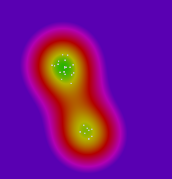

* Example 1: Two normal sub-states that are significantly different
  
  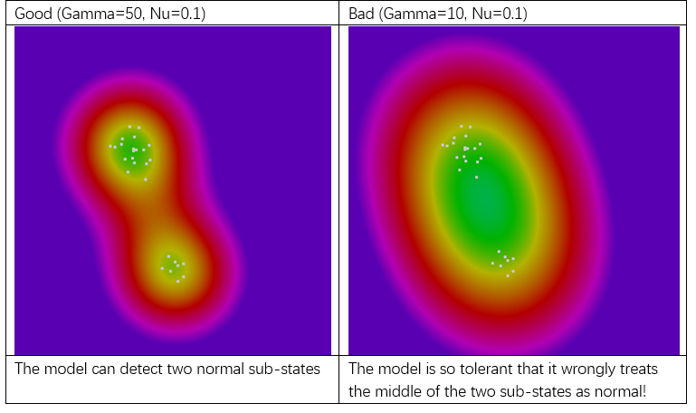 

* Example 2: One normal sub-state, but data variance is large (due to disturbances)
  
  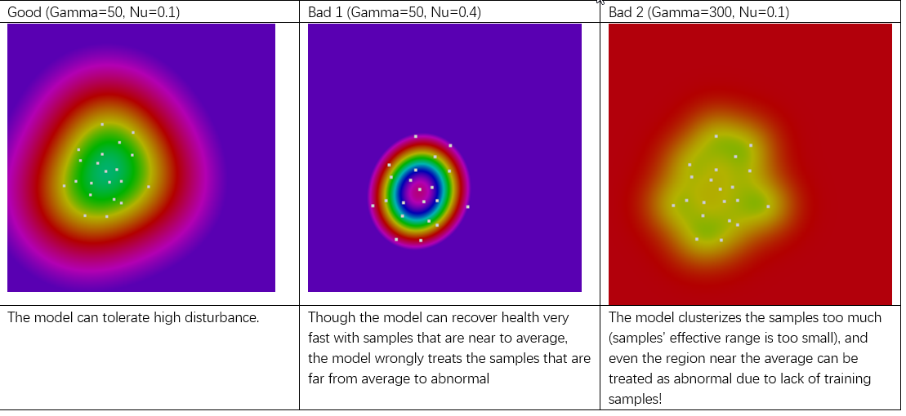 

Note: The model is the “one-class Support Vector Machine”, below are some more technical-oriented explanation of Gamma and Nu:
Gamma (γ): Gamma is a parameter of the kernel function that determines the distribution of data after it is mapped to a higher-dimensional space. In the Radial Basis Function (RBF), a larger gamma value implies a smaller decision boundary, making the model more focused on the local characteristics of the training data; whereas a smaller gamma value suggests a larger decision boundary, resulting in a smoother model that is less sensitive to local fluctuations in the training data.

Nu (ν): Nu is a user-defined parameter that represents the upper limit of the proportion of error data points and the lower limit of the margin. This parameter helps control the ratio of support vectors as well as the looseness of the decision boundary. Simply put, a smaller nu value makes the model more inclined to ignore more outliers, leading to a wider decision boundary; conversely, a larger nu value makes the model more inclined to include more data points, resulting in a narrower decision boundary.

## 6. Support 
- Reach out to NXP Sensors Community page for more support - [NXP Community](https://community.nxp.com/t5/forums/postpage/choose-node/true?_gl=1*fxvsn4*_ga*MTg2MDYwNjMzMy4xNzAyNDE4NzM0*_ga_WM5LE0KMSH*MTcwMjQxODczMy4xLjEuMTcwMjQxODczNi4wLjAuMA..)
- Learn more about FXLS8974CF 3-axis accelerometer, refer to - [FXLS8974CF DS](https://www.nxp.com/docs/en/data-sheet/FXLS8974CF.pdf)
- Accelerate your sensors development using Sensor ToolBox, refer to - [Sensors Development Ecosystem](https://www.nxp.com/design/design-center/software/sensor-toolbox:SENSOR-TOOLBOXX)

#### Project Metadata

<!----- Boards ----->

<!----- Categories ----->

<!----- Peripherals ----->

<!----- Toolchains ----->

Questions regarding the content/correctness of this example can be entered as Issues within this GitHub repository.

>**Warning**: For more general technical questions regarding NXP Microcontrollers and the difference in expected functionality, enter your questions on the [NXP Community Forum](https://community.nxp.com/)

## 7. Release Notes
| Version | Description / Update                           | Date                        |
|:-------:|------------------------------------------------|----------------------------:|
| 1.0     | Initial release on Application Code Hub        | December 4th 2024 |

## Licensing

*If applicable - note software licensing here with links to licenses, otherwise remove this section*

## Origin

*if applicable - note components your application uses regarding to license terms - with authors / licenses / links to licenses, otherwise remove this section*